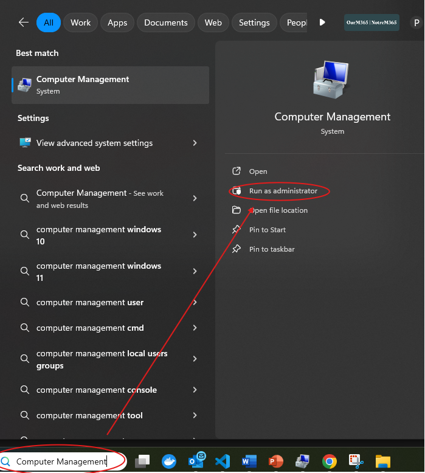
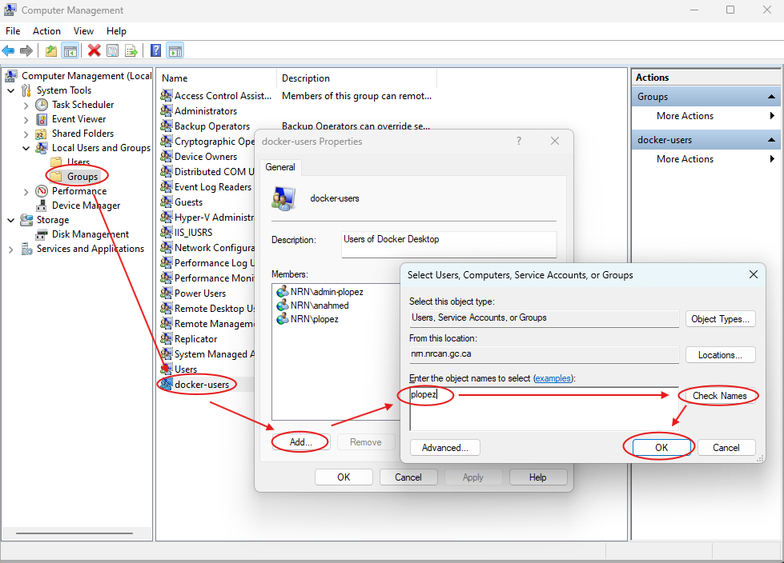

## Quick Install for Window Users. 
1. Download the [installer](https://www.docker.com/products/docker-desktop)
1. Double-click Docker Desktop Installer.exe to run the installer. By default, Docker Desktop is installed at C:\Program Files\Docker\Docker. You will be prompted for admin authorization.
1. When prompted, ensure the Use WSL 2 instead of Hyper-V option on the Configuration page is selected or not depending on your choice of backend.  If your system only supports one of the two options, you won't be able to select which backend to use.
1. Follow the instructions on the installation wizard to authorize the installer and proceed with the install.
1. When the installation is successful, select Close to complete the installation process.
1. Type "Computer Management" in the windows search bar. Then click "run as an administrator". If you on an domain like NRCan, be sure you do this while on VPN. 
1. Navigate to Local Users and Groups > Groups > docker-users and add your username to the group. See example with username 'plopez'.

1. Reboot for the changes to take effect and start Docker Desktop.
